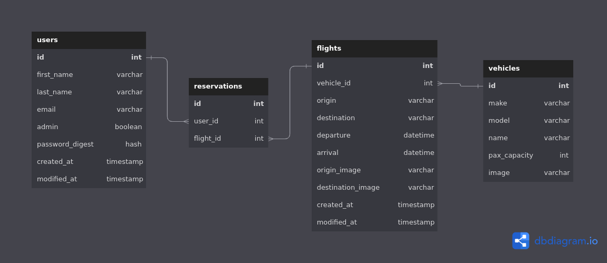

# 🌕 [Moonshot Spaceline](https://moonshot.nicweb.dev) 🚀


## Description

The final frontier is just the beginning...

Moonshot Spaceline (fictional 😝) is on a mission to make the cosmos available to everyone! Here at Moonshot, we believe space travel should resemble the glory days of aviation. Want chicken parmesan on your way to Venus? Sure! Here's some chicken parmesan! (It's going to be a long trip so it would be quite reckless of us not to feed you. You're responsible for bringing your own drinks, however).

Contained in this repository, is the source code for our state-of-the-art booking website complete with a minimal, easy to use interface and cool colors!

Thanks for checking us out! We hope you enjoy browsing our source code. Why not fork it and build it yourself?

Alright, let's get down to the nitty-gritty of the site.

## Backend Routes

The following table displays the routes for the backend API

| **Path**                                                                                    | **Request Type** | **Action**                                                                                 |
| ------------------------------------------------------------------------------------------- | ---------------- | ------------------------------------------------------------------------------------------ |
| /me                                                                                         | GET              | If the user ID contained in the session info exists in database, return authorized status. |
| /users                                                                                      | POST             | Create new user                                                                            |
| /user/[:id]                                                                                 | PATCH            | Update user data                                                                           |
| /user/[:id]                                                                                 | DELETE           | Delete user                                                                                |
| /sessions                                                                                   | POST             | Log user in                                                                                |
| /sessions                                                                                   | DELETE           | Log user out                                                                               |
| /origins                                                                                    | GET              | Retrieve list of flight origins                                                            |
| /destinations?origin=[:origin_id]                                                           | GET              | Retrieve list of flight destinations based on selected origin                              |
| /flights?num_passengers=[:num_passengers]&origin=[:origin_id]&destination=[:destination_id] | GET              | Retrieve list of flights based on selected origin and destination                          |
| /reservations                                                                               | POST             | Create new reservation                                                                     |
| /reservations/[:id]                                                                         | DELETE           | Delete reservation                                                                         |
| /reservations                                                                               | GET              | Retrieve list of users reservations                                                        |

## Entity Relationship

The Entity-Relationship diagram below displays the relationships between the 5 tables within this applications database.



---

## Install

### Clone the repository

```bash
git clone https://github.com/NicMortelliti/moonshot.git
cd moonshot
```

## Backend Setup

### Check your Ruby version

This application was build using Ruby 2.7.6.

```properties
ruby -v
```

If you need to install Ruby 2.7.6 and you have [rvm](https://rvm.io/) installed, use the following command.

```properties
rvm install 2.7.6
```

### Check your Rails version

This application was build using Rails 6.1.3.

```properties
rails -v
```

If you need to install Rails 6.1.3, use the following command.

```properties
gem install rails -v 6.1.3
```

### Install PostgreSQL

This application was build using PostgreSQL for its database. Please follow the instructions found on the [PostgreSQL site](https://www.postgresql.org/docs/current/tutorial-install.html) for installation and setup.

Ensure you have a PostgreSQL database set up with user access to it before moving on.

### Install dependencies

```properties
gem install bundler
bundle install
```

### Initialize the database

```properties
rails db:create db:migrate db:seed
```

## Frontend Setup

Use the package manager [npm](https://www.npmjs.com/) to install the frontend dependencies.

```properties
npm install --prefix client
```

---

## Run Application

Start the backend server with

```properties
rails s
```

Open a new console tab or window, then enter:

```properties
npm start --prefix client
```

The Rails server should now be running on `localhost:3000` and the client server should be running on `localhost:4000`

---

## Docker

If you'd like to just run this application without the hassle of installing its dependencies, use [Docker](https://www.docker.com/get-started/) and [Docker Compose](https://docs.docker.com/compose/install/).

With Docker running:

1. Open a terminal at the root level of the application.
2. Enter `docker-compose up --build`
3. In a browser, navigate to `localhost:3000`

---

## Usage

### Setting up a new user account

1. Navigate to [http://localhost:4000/register](http://localhost:4000/register)

2. Enter new user credentials.

3. Click the `Submit` button.

### Log in as an existing user

1. Navigate to [http://localhost:4000/login](http://localhost:4000/login)

2. Enter your user credentials.

3. Click the `Submit` button.

## Logout

_User must be logged in before continuing._

1. Click `Log Out`.

## Change users password

_User must be logged in before continuing._

1. Navigate to [http://localhost:4000/my-profile](http://localhost:4000/my-profile)

2. Click `Change password`.

3. Enter new password in both password fields.

4. Click `Submit` to update the password **OR** click `Nevermind` to cancel changing then password.

## Delete users account

_User must be logged in before continuing._

1. Navigate to [http://localhost:4000/my-profile](http://localhost:4000/my-profile)

2. Click `Delete account`.

3. Click `Yes, delete my account` to delete the users account **OR** click `Nevermind` to cancel deleting the users account.

### Book a flight

_User must be logged in before continuing._

1. Navigate to [http://localhost:4000/flight-search](http://localhost:4000/flight-search)

2. Select an origin.

3. Select a destination.

4. Find a flight you would like to book.

5. Click `Book Flight`

6. Confirm you would like to book the flight by clicking `Yes, book it!` **OR** cancel booking the flight by clicking `Nevermind`.

7. Click `Ok!` on the booking confirmation page.

### View and/or cancel reservations

_User must be logged in before continuing._

1. Navigate to [http://localhost:4000/my-trips](http://localhost:4000/my-trips).

_To cancel a reservations, continue with the next steps..._

2. Click `Cancel`

3. Confirm you would like to cancel the reservation by clicking `Yes, cancel it` **OR** keep the reservation by clicking `Nevermind`.

---

[Image by vectorpocket / Freepik](https://www.freepik.com/free-vector/future-space-station_3823978.htm#query=spacecraft&from_query=spacecraft%20inside&position=18&from_view=search&track=sph)
